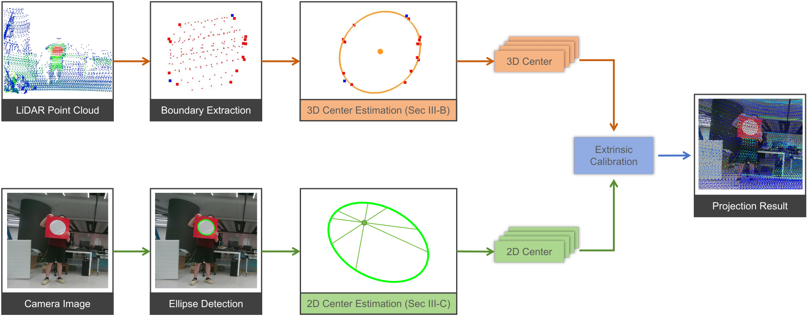
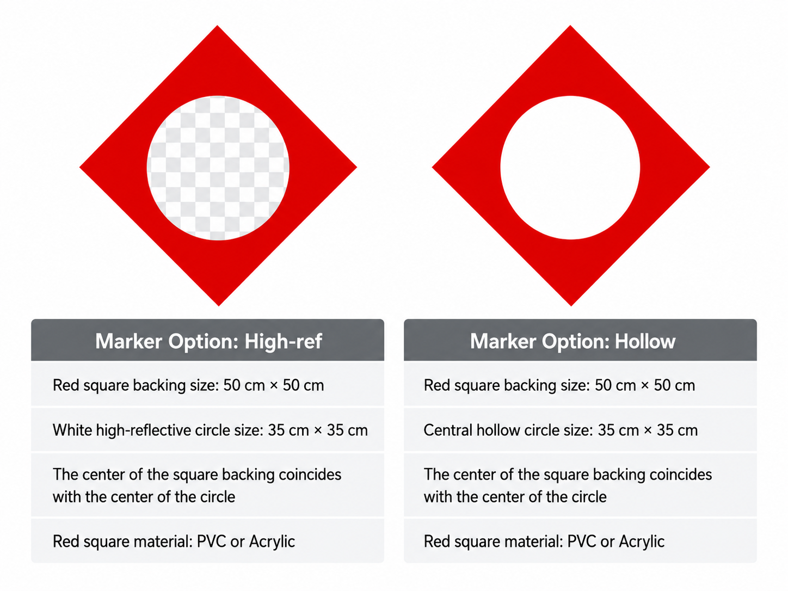

# Circular Center Calibration

Modular reference implementation for 3D/2D circular-center measurement and
LiDAR-camera extrinsic calibration.



<p align="center"><em>Accurate 3D and 2D circular-center estimation for camera&ndash;LiDAR extrinsic calibration.</em></p>

## Installation

### Conda

```bash
conda env create -f environment.yml
conda activate circular-center-calibration
```


### Pip

From the repository root:

```bash
python -m pip install -e '.[all]'
```

### AAMED

Initialize the official AAMED submodule and build its Python extension:

```bash
git submodule update --init --recursive thirdparty/AAMED
python tools/build_aamed.py
```

### PCL SACMODEL

The PCL baseline uses C++. After the Conda installation, build it once:

```bash
cmake -S . -B build -G Ninja -DCCC_BUILD_PCL_BASELINE=ON
cmake --build build
```

Python experiments load the library automatically. Other methods do not need
this step. Set `CIRCULAR_CENTER_PCL_LIBRARY` only for a custom library path.


## Experiments

| Experiment | Documentation | Paper correspondence |
| --- | --- | --- |
| Synthetic 3D circle-center accuracy | [Docs](docs/experiments/synthetic_3d_accuracy/README.md) | Direct Circular-Center Measurement / 3D Circle Center Measurement — Figure 5 and Table I |
| Synthetic 3D angular-support stress test | [Docs](docs/experiments/synthetic_3d_stress/README.md) | Direct Circular-Center Measurement / 3D Circle Center Measurement — Figure 6 |
| Synthetic 3D target tolerance | [Docs](docs/experiments/synthetic_3d_target_tolerance/README.md) | Direct Circular-Center Measurement / 3D Circle Center Measurement — Figure 7 |
| Synthetic 2D projected-center accuracy | [Docs](docs/experiments/synthetic_2d_accuracy/README.md) | Direct Circular-Center Measurement / 2D Projected-Center Measurement — Figure 8 |
| Synthetic 2D pose estimation | [Docs](docs/experiments/synthetic_2d_pose/README.md) | Direct Circular-Center Measurement / 2D Projected-Center Measurement — Figure 9 |
| Quasi-RANSAC evaluation | [Docs](docs/experiments/quasi_ransac_evaluation/README.md) | Direct Circular-Center Measurement / Quasi-RANSAC Evaluation — Table II |
| 3D runtime benchmark | [Docs](docs/experiments/benchmark_3d_runtime/README.md) | Implementation and Computational Cost — Table III |
| Qualitative real-world calibration | [Docs](docs/experiments/qualitative_realworld/README.md) | Real-World Calibration — Figure 11 |

See the [experiment implementation index](experiments/README.md) for code
ownership and technical protocols.


## Calibration Board

The experiments use two target variants: a high-reflective circular marker and
a hollow circular marker. Both designs use a 50 cm by 50 cm square backing with
a centered 35 cm circle, so the square and circle share the same center.




## License

The top-level project is licensed under Apache-2.0. The separately maintained
`thirdparty/AAMED` Git submodule is licensed under GPL-2.0 and is not covered
by the top-level Apache-2.0 license. See
[`NOTICE`](NOTICE) and
[`thirdparty/AAMED/LICENSE`](thirdparty/AAMED/LICENSE).
