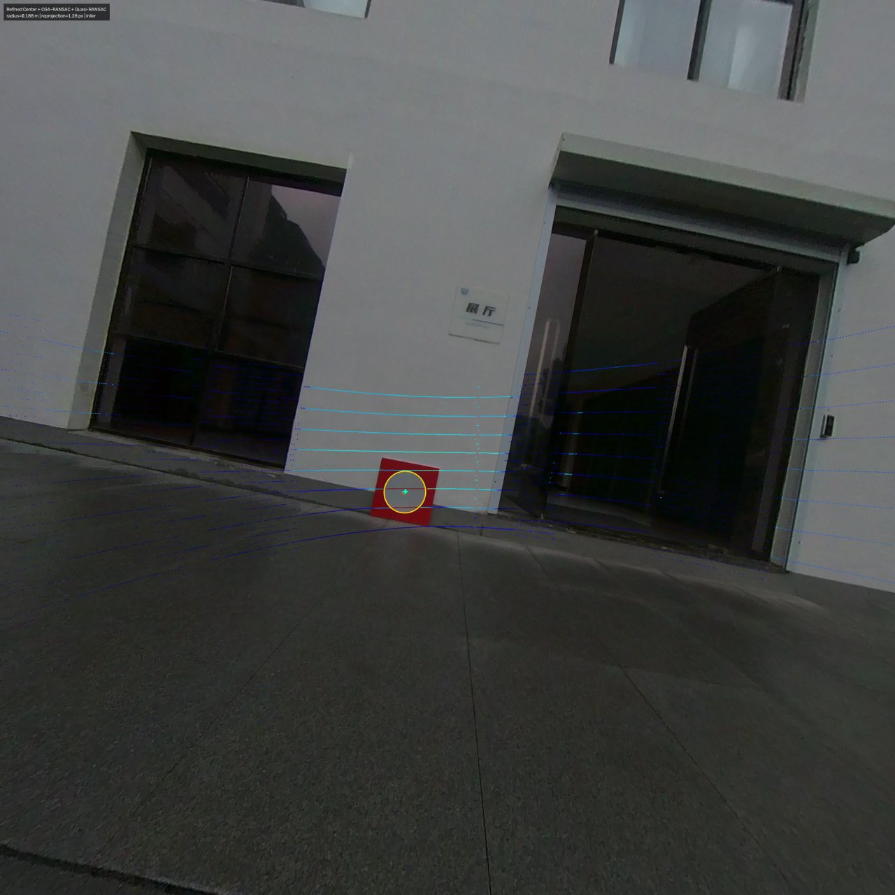

# 真实场景定性实验

[English](README.md)

该实验分别从相机图像和高强度 LiDAR 点中提取圆形标定板，估计 LiDAR 到相机的外参，
并生成点云与圆心投影结果，对应论文 Figure 11。

## 1. 下载数据

下载
[`circular-center-calibration-data.zip`](https://drive.google.com/file/d/1dgud8KO8id8efYu2VCKPBQoMfGRreUxE/view?usp=sharing)，
其中包含 Lab、Office 和 `insta_hesai_outdoor` 三套真实场景数据。也可以在仓库根目录
直接运行：

```bash
mkdir -p data/downloads
curl --fail --location \
  'https://drive.usercontent.google.com/download?id=1dgud8KO8id8efYu2VCKPBQoMfGRreUxE&export=download&confirm=t' \
  --output data/downloads/circular-center-calibration-data.zip
```

解压后，将其中的三个数据集目录放到仓库的 `data/` 下：

```bash
unzip -q data/downloads/circular-center-calibration-data.zip -d data/downloads
mv data/downloads/circular-center-calibration-data/orbbec_livox_lab data/
mv data/downloads/circular-center-calibration-data/orbbec_livox_office data/
mv data/downloads/circular-center-calibration-data/insta_hesai_outdoor data/
```

## 2. 检查数据目录

解压后的目录结构如下：

```text
data/
├── orbbec_livox_office/
│   ├── dataset.yaml
│   ├── camera_info.yaml
│   ├── img/*.png             # 37 张图像
│   └── pcd/*.pcd             # 37 份点云
├── orbbec_livox_lab/
│   ├── dataset.yaml
│   ├── camera_info.yaml
│   ├── img/*.png             # 67 张图像
│   └── pcd/*.pcd             # 67 份点云
└── insta_hesai_outdoor/
    ├── dataset.yaml          # dataset: insta_hesai_outdoor
    ├── camera_info.yaml      # 已去畸变的 CamBack 内参
    ├── img/*.png             # 7 张图像
    └── pcd/*.pcd             # 7 份 Hesai 点云
```

每对图像和点云使用相同的数字文件名。使用以下命令检查数量：

```bash
find data/orbbec_livox_office/img -name '*.png' -type f | wc -l
find data/orbbec_livox_office/pcd -name '*.pcd' -type f | wc -l
find data/orbbec_livox_lab/img -name '*.png' -type f | wc -l
find data/orbbec_livox_lab/pcd -name '*.pcd' -type f | wc -l
find data/insta_hesai_outdoor/img -name '*.png' -type f | wc -l
find data/insta_hesai_outdoor/pcd -name '*.pcd' -type f | wc -l
```

六行输出应依次为 `37`、`37`、`67`、`67`、`7` 和 `7`。

## 3. 运行实验

先完成根目录 README 中的 [Installation](../../../README.md#installation)，然后构建
可选的 AAMED 官方扩展：

```bash
git submodule update --init --recursive thirdparty/AAMED
python tools/build_aamed.py
```

该工具使用固定版本的 `thirdparty/AAMED` 子模块，并针对当前 Conda 环境构建 Python
扩展。AAMED 是单独采用 GPL-2.0 的组件，不适用顶层项目的 Apache-2.0 许可证。

对每套数据运行前 10 帧：

```bash
circular-center-run \
  configs/experiments/qualitative_realworld/orbbec_livox.yaml \
  --max-frames 10 \
  --output-dir outputs/qualitative_realworld_orbbec_livox_preview
```

运行全部 104 对数据：

```bash
circular-center-run \
  configs/experiments/qualitative_realworld/orbbec_livox.yaml \
  --output-dir outputs/qualitative_realworld_orbbec_livox
```

运行全部 7 对 `insta_hesai_outdoor` Insta360/Hesai 数据：

```bash
circular-center-run \
  configs/experiments/qualitative_realworld/insta_hesai_outdoor.yaml \
  --output-dir outputs/qualitative_realworld_insta_hesai_outdoor
```

预处理使用 AAMED 检测椭圆，随后依次使用 `Refined Center`、`CGA-RANSAC` 和
`Quasi-RANSAC`。如需更换方法或数据集，修改对应的实验 YAML。

椭圆检测后端由 `experiments/qualitative_realworld/detection2d/config.yaml` 中的
`backend` 选择。将其设为 `opencv_red_board` 即可运行原有的封闭轮廓检测器。

每套数据中，成功提取的全部 `Refined Center` 二维圆心和 `CGA-RANSAC` 三维圆心共同
参与一次联合标定。`Quasi-RANSAC` 对二维圆心的两个候选结果进行消歧，最终使用全部
共识内点执行迭代 PnP 优化。`CGA-RANSAC` 和 `Quasi-RANSAC` 的随机种子均在中央方法
配置中固定为 `2025`。

## 4. 输出文件

```text
outputs/qualitative_realworld_orbbec_livox/
├── summary.json
├── orbbec_livox_office/
│   ├── 00001.png
│   └── ...
└── orbbec_livox_lab/
    ├── 00001.png
    └── ...
```

该命令生成 `summary.json`，并在
`outputs/qualitative_realworld_insta_hesai_outdoor/insta_hesai_outdoor/`
下生成 7 张投影图。

`summary.json` 逐帧记录二维候选圆心、最终圆心、三维圆心和半径、圆拟合内点、标定内点、
外参以及重投影误差。

## 5. 实验结果

在二维圆心、三维圆心和标定方法完全相同的条件下，对比结果如下：

| 椭圆检测器 | 数据集 | 输入帧数 | 成功提取圆心 | 标定内点 | 平均重投影误差 |
| --- | --- | ---: | ---: | ---: | ---: |
| OpenCV 红板封闭轮廓 | `orbbec_livox_lab` | 67 | 60 | 57 | 3.094 px |
| AAMED | `orbbec_livox_lab` | 67 | 65 | 62 | 2.255 px |
| OpenCV 红板封闭轮廓 | `orbbec_livox_office` | 37 | 27 | 27 | 2.734 px |
| AAMED | `orbbec_livox_office` | 37 | 34 | 33 | 1.696 px |
| AAMED | `insta_hesai_outdoor` | 7 | 7 | 7 | 2.149 px |

按全部标定内点加权，AAMED 将平均重投影误差从 `2.978 px` 降至 `2.061 px`，降幅为
`30.8%`。

图中投影完整 LiDAR 点云，并按强度由蓝色（低）到红色（高）着色。黄色曲线是图像
椭圆，绿色圆点是最终选择的二维圆心，青色十字是投影后的三维圆心。

### Lab


### Office


### `insta_hesai_outdoor`


