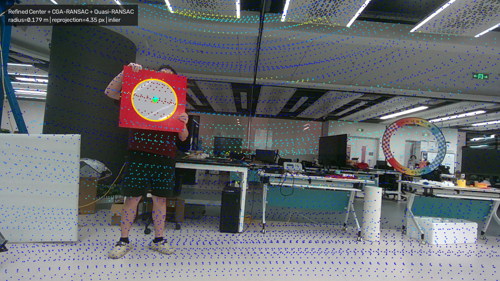
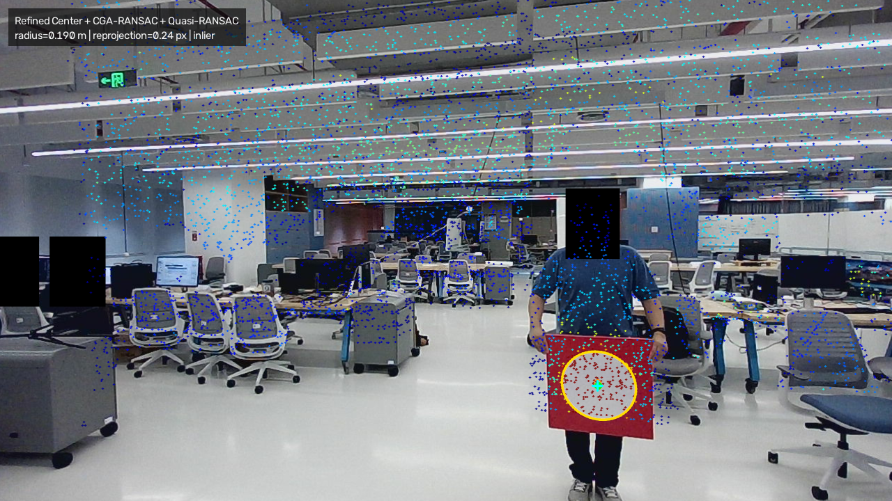

# 真实场景定性实验

该实验分别从相机图像和高强度 LiDAR 点中提取圆形标定板，估计 LiDAR 到相机的
外参，并生成点云与圆心投影结果，对应论文 Figure 11。

## 1. 下载数据

下载
[`circular-center-calibration-data.zip`](https://drive.google.com/file/d/15KnnDbFxnf1pKnCbVjomoJlxTrxz39tC/view?usp=sharing)。
复现包应发布完整的 lab 67 帧序列，而不是早期 `far-*`、`front-*`、`mid-*` 导出结果的
混合。人脸可以保留隐私遮挡；仓库内的 partial-arc 检测器已经针对这份发布数据修复并
验证。

也可以在仓库根目录直接下载：

```bash
mkdir -p data/downloads
curl --fail --location \
  'https://drive.usercontent.google.com/download?id=15KnnDbFxnf1pKnCbVjomoJlxTrxz39tC&export=download&confirm=t' \
  --output data/downloads/circular-center-calibration-data.zip
```

解压后，将三个数据集目录放到仓库的 `data/` 下：

```bash
unzip -q data/downloads/circular-center-calibration-data.zip -d data/downloads
mv data/downloads/circular-center-calibration-data/orbbec_livox_lab data/
mv data/downloads/circular-center-calibration-data/orbbec_livox_office data/
mv data/downloads/circular-center-calibration-data/zju data/
```

## 2. 检查数据

```text
data/
├── orbbec_livox_office/
│   ├── dataset.yaml
│   ├── camera_info.yaml
│   ├── img/*.png             # 37 张图像
│   └── pcd/*.pcd             # 37 份点云
├── orbbec_livox_lab/
│   ├── dataset.yaml
│   ├── camera_info.yaml
│   ├── img/*.png             # 67 张图像
│   └── pcd/*.pcd             # 67 份点云
└── zju/
    ├── dataset.yaml
    ├── camera_info.yaml
    ├── insta360_config.yaml
    ├── img/*.png             # 7 张图像
    └── pcd/*.pcd             # 7 份点云
```

每对图像和点云使用相同的数字文件名。运行前核对发布的隐私遮挡版 67 帧序列：

```bash
python tools/verify_realworld_data.py \
  data/orbbec_livox_lab \
  docs/experiments/qualitative_realworld/orbbec_livox_lab_privacy_masked_images.sha256 \
  docs/experiments/qualitative_realworld/orbbec_livox_lab_point_clouds.sha256
```

同样校验 37 对 Office 序列：

```bash
python tools/verify_realworld_data.py \
  data/orbbec_livox_office \
  docs/experiments/qualitative_realworld/orbbec_livox_office_images.sha256 \
  docs/experiments/qualitative_realworld/orbbec_livox_office_point_clouds.sha256
```

公开复现不需要未遮挡图像。`orbbec_livox_lab_raw_images.sha256` 只用于标识作者侧的
原图审计副本，不代表需要公开的数据。

ZJU 图像是历史 `src/undistort.py` 输出的、已经去畸变的 `CamBack` 帧。规范化后的
`camera_info.yaml` 因此使用 CamBack 内参和零畸变；如果再次应用
`insta360_config.yaml` 中的鱼眼畸变参数，会造成二次去畸变。

```bash
python tools/verify_realworld_data.py \
  data/zju \
  docs/experiments/qualitative_realworld/zju_images.sha256 \
  docs/experiments/qualitative_realworld/zju_point_clouds.sha256
```

### 自动检测与历史手工椭圆

旧流程先由 AAMED 给出椭圆候选，再人工选择标定板上的椭圆。当前检测器根据红色板面
支持度自动选择；当完整闭合轮廓被遮挡时，使用固定随机种子的 partial-arc 拟合。

```bash
python tools/compare_manual_auto_ellipses.py \
  data/orbbec_livox_lab \
  path/to/ellipses.txt \
  --output-csv outputs/manual_vs_auto_ellipses.csv
```

在恢复的未遮挡 67 帧序列上，自动检测能够找到全部 67 个椭圆，其中 66 帧与历史手工
结果选择了同一个板面目标。圆心差的中位数是 0.304 px，95 分位数是 0.472 px。
`00060` 是唯一例外：图像核对表明历史手工行误选了背景圆环，自动结果才位于标定板。
因此，手工筛选不是复现差距的根因。

隐私编辑确实与旧闭合轮廓检测器在 `00018`、`00050`、`00066` 的搜索区域重叠；新增的
partial-arc fallback 已恢复这三帧。67 帧中，新检测器的原图—遮挡图椭圆圆心变化中位数
为 0 px，95 分位数为 0.021 px，最大值为 0.579 px。

## 3. 运行实验

先创建与 golden result 完全一致的参考环境：

```bash
conda env create -f environment-realworld.yml
conda activate circular-center-calibration-realworld
```

也可以先完成根目录 README 中的 [Installation](../../../README.md#installation)，得到兼容但不完全
锁定的开发环境。然后预览前 10 帧：

```bash
circular-center-run \
  configs/experiments/qualitative_realworld/paper.yaml \
  --max-frames 10 \
  --output-dir outputs/qualitative_realworld_preview
```

运行全部 67 对图像和点云：

```bash
circular-center-run \
  configs/experiments/qualitative_realworld/paper.yaml \
  --output-dir outputs/qualitative_realworld
```

运行可选的 ZJU 7 对验证数据：

```bash
circular-center-run \
  configs/experiments/qualitative_realworld/zju.yaml \
  --output-dir outputs/qualitative_realworld_zju
```

单独运行 Office 序列：

```bash
circular-center-run \
  configs/experiments/qualitative_realworld/office.yaml \
  --output-dir outputs/qualitative_realworld_office
```

论文配置依次使用 `Refined Center`、`CGA-RANSAC` 和 `Quasi-RANSAC`。所有随机阶段固定
seed=`2025`：partial-arc 和 CGA-RANSAC 使用显式种子，PnP 前还会重置 OpenCV RNG。
进入标定前，每个无序二维候选对按固定规则排序；Quasi-RANSAC 使用 MSAC 评分并固定
计算 2,000 个假设，避免输入顺序或自适应提前停止让不同检测器落入不同的消歧分支。

这个真实场景配置不会调用 PCL，因此 PCL 版本不能解释本实验的差异；PCL 只影响单独的
`PCL SACMODEL` 基线。

每套数据中，成功提取的全部 `Refined Center` 二维圆心和 `CGA-RANSAC` 三维圆心共同
参与联合标定。Quasi-RANSAC 解决两个二维候选之间的歧义，最后用全部共识内点执行
迭代 PnP。

## 4. 输出文件

```text
outputs/qualitative_realworld/
├── summary.json
└── orbbec_livox_lab/
    ├── 00001.png
    └── ...
```

`summary.json` 逐帧记录检测提案来源、二维候选和最终圆心、三维圆心与半径、圆拟合内点、
标定内点、外参及逐帧重投影误差。

兼容字段 `mean_reprojection_error_px` 是仅对 inlier 计算的均值；新结果同时明确输出
`mean_reprojection_error_all_px` 和
`mean_reprojection_error_inliers_px`。

## 5. 可复现结果

公开的隐私遮挡版 67 帧序列在 seed=`2025` 下得到：

| 输入帧 | 图像椭圆 | 3D/2D 对应 | 标定 inlier | 全部对应点平均误差 | inlier 平均误差 |
| ---: | ---: | ---: | ---: | ---: | ---: |
| 67 | 67 | 65 | 61 | 2.634 px | 2.195 px |

缺少的两个对应是 `00052` 和 `00063`：失败发生在独立的 LiDAR 三维圆拟合阶段，并非
二维图像检测失败。

完整运行后可核对全精度结果：

```bash
python tools/verify_realworld_result.py \
  outputs/qualitative_realworld/summary.json \
  docs/experiments/qualitative_realworld/expected_lab_privacy_masked_seed2025.json
```

作者侧的未遮挡副本得到 65 个对应、62 个 inlier、全部对应点误差 2.603 px、inlier
误差 2.270 px。原图和遮挡图之间的变化很小，说明隐私遮挡不再是当前标定误差的实质
来源。

ZJU 序列得到 7 个对应和 7 个 inlier，全部对应点与 inlier 的平均重投影误差均为
1.950571 px。7 帧都由自动 HSV 板面检测器完成；与恢复的历史 AAMED/人工椭圆相比，
圆心差中位数为 1.284 px，最大值为 1.526 px。

```bash
python tools/verify_realworld_result.py \
  outputs/qualitative_realworld_zju/summary.json \
  docs/experiments/qualitative_realworld/expected_zju_seed2025.json
```

Office 序列得到 34 个对应和 33 个 inlier；全部对应点的平均重投影
误差为 1.820509 px，inlier 平均误差为 1.583410 px。`00014`、`00023`
和 `00028` 在独立的 3D 目标提取阶段失败。

```bash
python tools/verify_realworld_result.py \
  outputs/qualitative_realworld_office/summary.json \
  docs/experiments/qualitative_realworld/expected_office_seed2025.json
```

## 6. 内置检测器与外部 AAMED

AAMED 使用 GPL-2.0，本 Apache-2.0 仓库不直接捆绑它。它作为可选外部检测器，比较时
固定到上游 `v1.0`、commit `7c8345a01eeb5c852585676fbe414703504bff04`。版本来源和
预计算椭圆回放方法见 [`docs/dependencies/aamed.md`](../../dependencies/aamed.md)。

两个检测器都能找到 67 个图像椭圆。下表只替换二维椭圆检测器；数据、三维圆心、随机
种子、固定 2,000 个假设的 MSAC 求解和 PnP 完全相同。

| 图像 | 检测器 | 3D/2D 对应 | Inlier | 全部对应点平均误差 | Inlier 平均误差 |
| --- | --- | ---: | ---: | ---: | ---: |
| 未遮挡审计副本 | HSV + partial arc | 65 | 62 | 2.603 px | 2.270 px |
| 未遮挡审计副本 | 外部 AAMED v1 | 65 | 62 | 2.644 px | 2.321 px |
| 隐私遮挡发布数据 | HSV + partial arc | 65 | 61 | 2.634 px | 2.195 px |
| 隐私遮挡发布数据 | 外部 AAMED v1 | 65 | 62 | 2.642 px | 2.320 px |

在发布图像上，两者按全部对应点计算只差 0.008 px，所以它们在该数据集的标定层面确实
相近。inlier 均值不能直接相减，因为两者的 inlier 集分别包含 61 和 62 个观测。

早先的初步对比曾得到 HSV 约 2.29 px、AAMED 约 3.03 px，但那不是只改变检测器的公平
比较：自适应提前停止与未规范化的候选顺序使 Quasi-RANSAC 选中了不同的消歧解。
固定候选对顺序和 fixed-budget MSAC 后，这个求解器混杂因素被移除。AAMED 在椭圆层面
仍然更不受 mask 影响（圆心最大变化 0.061 px，而 HSV + partial arc 为 0.579 px），
因此当用户能够接受 GPL 条款，或数据不具备红色板面先验时，仍建议把 AAMED 作为外部
可选方案。

全精度测量记录在 `detector_comparison_seed2025.json`。

渲染图投影完整 LiDAR 点云，并按强度由蓝色（低）到红色（高）着色。黄色曲线是检测
椭圆，绿色圆点是最终二维圆心，青色十字是投影后的三维圆心。

### Lab



### Office


