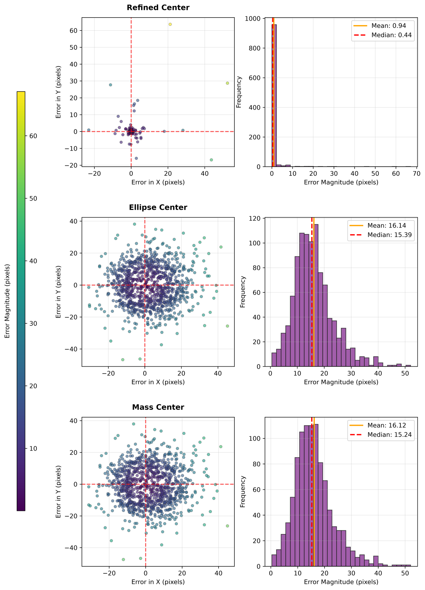

# Synthetic 2D Projected-Center Accuracy: Configuration and Usage

[中文](README_zh.md)

Run all commands below from the repository root. This experiment generates the
error distributions corresponding to paper Figure 8, together with per-trial
results for `Ellipse Center`, `Mass Center`, and `Refined Center`.

## 1. Prepare the environment

Complete the environment installation described in the repository
[README Installation](../../../README.md#installation). This experiment does
not require the optional PCL build.

## 2. Run the quick check

```bash
circular-center-run \
  configs/experiments/synthetic_2d_accuracy/ci.yaml \
  --output-dir outputs/synthetic_2d_accuracy_ci
```

This profile runs two trials to verify generation, method dispatch, homography
selection, statistics, and plotting.

## 3. Run the full experiment

```bash
circular-center-run \
  configs/experiments/synthetic_2d_accuracy/paper.yaml \
  --output-dir outputs/synthetic_2d_accuracy
```

The `paper` profile runs 1000 trials. Each trial projects two equal-radius,
coplanar nonconcentric circles with camera intrinsics
`(fx, fy, cx, cy) = (600, 600, 640, 480)`, adds `sigma = 1 px` contour noise,
fits ellipses, and uses the second circle for homography validation.

Use the existing `paper` configuration without changing
`experiments/synthetic_2d_accuracy/protocol.yaml` or
`experiments/synthetic_2d_accuracy/profiles/paper.yaml` when reproducing Figure
8.

## 4. Configure methods

The outer configuration only selects participating methods:

```yaml
schema_version: 1
experiment: synthetic_2d_accuracy
datasets: [paper]
methods:
  2d: [Ellipse Center, Mass Center, Refined Center]
  3d: null
  ambiguity: Homography Validation
```

To compare another 2D method, register it under `configs/methods/2d/` and add
its paper-facing name to `methods.2d`. A method returning two candidates also
requires a compatible ambiguity method. Figure-specific generation and search
parameters remain in this experiment directory.

## 5. Outputs

```text
outputs/synthetic_2d_accuracy/
├── summary.json
└── paper/
    ├── validation_error_distribution.png
    ├── raw_results.csv
    ├── method_summary.csv
    └── paper_comparison.csv
```

`raw_results.csv` contains one header row and 3000 method records:

```bash
wc -l outputs/synthetic_2d_accuracy/paper/raw_results.csv
```

`paper_comparison.csv` compares mean, standard deviation, median, p95, and
maximum error against the archived Figure 8 trial data.

## 6. Results

One full run produced the following image and values.



| Method | Mean (px) | Median (px) | p95 (px) | Paper mean (px) |
| --- | ---: | ---: | ---: | ---: |
| Refined Center | 0.9415 | 0.4427 | 1.4534 | 1.2672 |
| Ellipse Center | 16.1364 | 15.3862 | 29.9091 | 16.1364 |
| Mass Center | 16.1165 | 15.2437 | 29.3413 | 16.1164 |

The two baselines reproduce the archived statistics to numerical precision.
For `Refined Center`, the median is identical and p95 differs by about 1.8%,
while the mean is about 25.7% lower because a few degenerate candidate searches
in the archived CSV have a different long tail from the released late CCFinder
source. The principal paper conclusion is reproduced: the refined center has a
much lower and tighter error distribution than either baseline. The exact
differences are recorded in `paper_comparison.csv`.

## Troubleshooting

- `Refined Center returned multiple candidates ...`: select
  `Homography Validation` in `methods.ambiguity`.
- `OpenCV is required`: activate the environment installed from the root
  README.
- The CI profile contains 2 trials; the paper profile contains 1000 trials.
