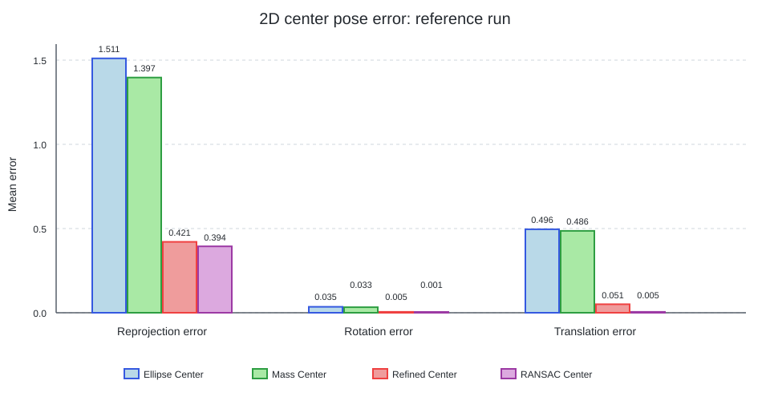

# 二维圆心位姿实验：配置与运行

[English](README.md)

以下命令均在仓库根目录执行，用于生成论文 Figure 9 对应的位姿误差图和逐次 PnP
结果。

## 1. 准备环境

按照仓库根目录 [README Installation](../../../README.md#installation) 完成环境安装。
本实验不需要额外构建 PCL。

## 2. 快速检查

```bash
circular-center-run \
  configs/experiments/synthetic_2d_pose/ci.yaml \
  --output-dir outputs/synthetic_2d_pose_ci
```

CI profile 只运行一次包含 4 个圆的样本，用于检查数据生成、方法调用、歧义消解、PnP
评估、CSV 和绘图链路，并与完整配置使用同一执行链路。

## 3. 运行完整实验

```bash
circular-center-run \
  configs/experiments/synthetic_2d_pose/paper.yaml \
  --output-dir outputs/synthetic_2d_pose
```

`paper` profile 运行 50 个唯一 trial，每次包含 20 对圆心对应关系。`Ellipse Center`、
`Mass Center` 和经过单应性选择的 `Refined Center` 分别进入 PnP-RANSAC；
`Quasi-RANSAC` 直接消解 `Refined Center` 返回的双候选。生成 Figure 9 时仍使用论文图中
的历史标签 `RANSAC Center`。

复现实验时直接使用现有 `paper` 配置，不要修改
`experiments/synthetic_2d_pose/protocol.yaml` 或
`experiments/synthetic_2d_pose/profiles/paper.yaml`。

## 4. 配置方法

外层配置只选择参与实验的方法：

```yaml
schema_version: 1
experiment: synthetic_2d_pose
datasets: [paper]
methods:
  2d: [Ellipse Center, Mass Center, Refined Center]
  3d: null
  ambiguity: [Homography Validation, Quasi-RANSAC]
```

若要加入新的二维或歧义消解方法，先在 `configs/methods/` 注册，再把与论文一致的名字
加入相应列表。Figure 9 专用的数据生成、PnP 和兼容参数继续由实验目录管理。

## 5. 输出

```text
outputs/synthetic_2d_pose/
├── summary.json
└── paper/
    ├── error_bar_comparison.png
    ├── raw_results.csv
    ├── method_summary.csv
    └── paper_comparison.csv
```

`raw_results.csv` 应包含 1 行表头和 200 条方法记录：

```bash
wc -l outputs/synthetic_2d_pose/paper/raw_results.csv
```

`paper_comparison.csv` 逐项保存三类位姿误差的本次均值和 Figure 9 归档均值，不设置
宽松的通过阈值。

## 6. 实验结果

一次完整运行得到下图和数值。



| 方法 | 重投影误差（px） | 旋转误差（rad） | 平移误差 |
| --- | ---: | ---: | ---: |
| Ellipse Center | 1.5106 | 0.03507 | 0.4956 |
| Mass Center | 1.3966 | 0.03271 | 0.4862 |
| Refined Center | 0.4208 | 0.00526 | 0.0507 |
| RANSAC Center（`Quasi-RANSAC`） | 0.3945 | 0.00101 | 0.0051 |

两个 baseline 与归档均值的差异均小于 0.3%，两个改进方法也都明显优于 baseline。
两种改进方法的相对排序与归档图相反：发布的 99 行 CSV 实际只包含 50 个唯一生成
trial，同时复现所需的 NPZ 中间文件和旧版未设种子的 RANSAC 状态均未发布。本仓库对
每个唯一 seed 只运行一次并使用确定性采样；所有数值差异均保留在
`paper_comparison.csv` 中。

## 常见问题

- 出现 `Refined Center ... multiple candidates`：保留 `methods.ambiguity` 中的
  `Homography Validation`。
- 出现 `OpenCV is required`：确认已激活按照根目录 README 创建的环境。
- CI profile 使用 4 对对应关系检查完整链路；paper profile 每次使用 20 对对应关系。
