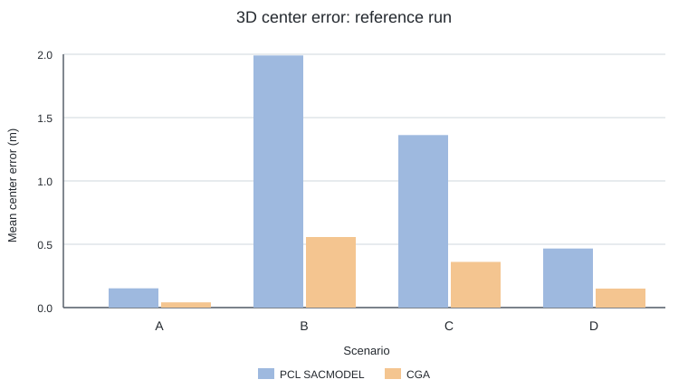

# 三维圆心精度实验：配置与运行

[English](README.md)

以下命令均在仓库根目录执行，用于生成论文 Figure 5（四种采样场景下的三维圆心
误差）和 Table I（不同离群比例下的平均三维圆心误差），以及对应的逐次结果。

## 1. 准备环境

按照仓库根目录 [README Installation](../../../README.md#installation) 完成环境安装和
PCL baseline 构建。

## 2. 快速检查

```bash
circular-center-run \
  configs/experiments/synthetic_3d_accuracy/ci.yaml \
  --output-dir outputs/synthetic_3d_accuracy_ci
```

该配置使用缩减样本检查方法加载、数据生成、统计和绘图链路。

## 3. 运行完整实验

```bash
circular-center-run \
  configs/experiments/synthetic_3d_accuracy/paper.yaml \
  --output-dir outputs/synthetic_3d_accuracy
```

完整配置包括：

- A–D 四种三维采样场景，每种运行 1000 次；
- `10%–50%` 五档离群比例，每档运行 100 次；
- Figure 使用 `CGA` 和 `PCL SACMODEL`；
- 离群点实验使用 `CGA-RANSAC` 和 `PCL SACMODEL`。

复现实验时直接使用现有 `paper` profile，不要修改
`experiments/synthetic_3d_accuracy/protocol.yaml` 或 `profiles/paper.yaml`。

## 4. 配置方法

外层配置只选择参与实验的方法：

```yaml
schema_version: 1
experiment: synthetic_3d_accuracy
datasets: [paper]
methods:
  2d: null
  3d: [CGA, CGA-RANSAC, PCL SACMODEL]
  ambiguity: null
```

若要测试新方法，先在 `configs/methods/3d/` 注册，然后将其名字加入
`methods.3d`。实验参数继续由实验目录统一管理。

## 5. 输出

```text
outputs/synthetic_3d_accuracy/
├── summary.json
└── paper/
    ├── 3d-monte.pdf
    ├── 3d-monte.png
    ├── raw_results.csv
    ├── outlier_summary.csv
    ├── outlier_table.tex
    └── paper_comparison.csv
```

`raw_results.csv` 应包含 1 行表头和 9000 条实验记录：

```bash
wc -l outputs/synthetic_3d_accuracy/paper/raw_results.csv
```

## 6. 实验结果

一次完整运行得到下图和表格。



| 方法 | 10% | 20% | 30% | 40% | 50% |
| --- | ---: | ---: | ---: | ---: | ---: |
| PCL SACMODEL | 0.0707 | 0.0676 | 0.0683 | 0.0736 | 0.0681 |
| CGA-RANSAC | 0.0340 | 0.0356 | 0.0342 | 0.0340 | 0.0343 |

`CGA-RANSAC` 在各档离群率下保持在 `0.0340 m` 至 `0.0356 m`，
`PCL SACMODEL` 保持在 `0.0676 m` 至 `0.0736 m`。`paper_comparison.csv`
记录对应论文数值和差异。

## 常见问题

- `PCL SACMODEL ... unavailable`：重新按照 README 的 PCL 构建步骤操作，或设置
  `CIRCULAR_CENTER_PCL_LIBRARY`。
- 找不到 `circular-center-run`：确认 Conda 环境已经激活，并已完成 README 中的
  Installation。
- CI 配置每个设置运行 2 次；paper profile 保留完整论文规模。
